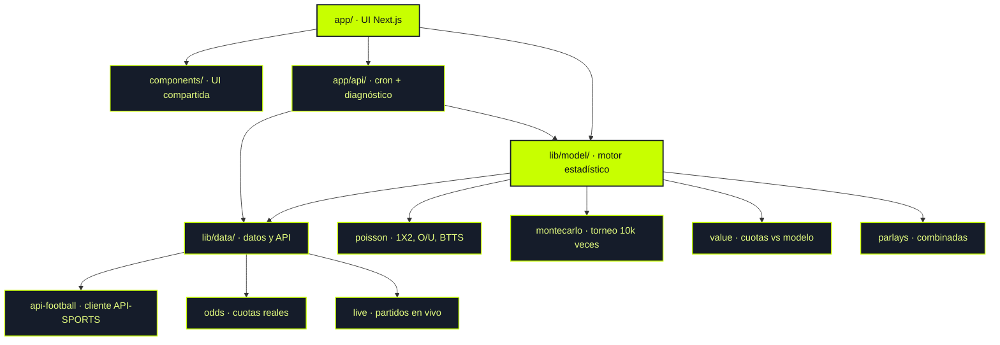
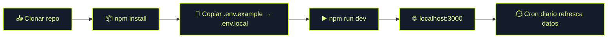

<div align="center">

<h1>⚽ MUNDIAL<span>26</span> · IA PREDICTOR</h1>

**Así predice la IA el Mundial 2026**

_Modelo de Poisson + 10.000 simulaciones Monte Carlo sobre las 48 selecciones y los 72 partidos._

<br/>


</div>

---

## 🧭 Qué es esto

Una app web que **proyecta el Mundial 2026** combinando dos motores estadísticos:

- **Poisson** → probabilidades por partido (1X2, over/under, BTTS, marcador exacto, córners, tarjetas).
- **Monte Carlo** → corre el torneo completo 10.000 veces para estimar campeón, finalistas y Bota de Oro.

Además compara las probabilidades del modelo con las **cuotas reales** de las casas (API-Football) para detectar **value bets** y armar **parleys**. Todo el cálculo del modelo es matemática pura, rápida y testeable; la API solo se usa para refrescar datos vía cron.

> ⚠️ Análisis estadístico de entretenimiento. **No es asesoría de apuestas.**

---

## 🗺️ Mapa del repositorio



---

## 📂 Navegación rápida

| 📁 Carpeta | Qué encuentras | Archivos clave |
| --- | --- | --- |
| 🖥️ **`app/`** | Páginas y rutas de Next.js (App Router) | [`page.tsx`](app/page.tsx) · [`grupos`](app/grupos/page.tsx) · [`partidos`](app/partidos/page.tsx) · [`campeon`](app/campeon/page.tsx) · [`valor`](app/valor/page.tsx) · [`parleys`](app/parleys/page.tsx) · [`mi-polla`](app/mi-polla/page.tsx) · [`en-vivo`](app/en-vivo/page.tsx) |
| 🔌 **`app/api/`** | Endpoints serverless | [`cron/route.ts`](app/api/cron/route.ts) · [`diag/route.ts`](app/api/diag/route.ts) |
| 🧩 **`components/`** | UI reutilizable | [`site-header.tsx`](components/site-header.tsx) · [`flag.tsx`](components/flag.tsx) · [`ui.tsx`](components/ui.tsx) |
| 🧮 **`lib/model/`** | Motor estadístico | [`poisson.ts`](lib/model/poisson.ts) · [`montecarlo.ts`](lib/model/montecarlo.ts) · [`predict.ts`](lib/model/predict.ts) · [`value.ts`](lib/model/value.ts) · [`parlays.ts`](lib/model/parlays.ts) · [`group-standings.ts`](lib/model/group-standings.ts) |
| 🛰️ **`lib/data/`** | Datos y cliente de API | [`api-football.ts`](lib/data/api-football.ts) · [`odds.ts`](lib/data/odds.ts) · [`live.ts`](lib/data/live.ts) · [`teams.ts`](lib/data/teams.ts) · [`fixtures.ts`](lib/data/fixtures.ts) |
| ⏱️ **`scripts/`** | Tareas programadas | [`cron.ts`](scripts/cron.ts) |

---

## 🚀 Cómo usar el repo



```bash
# 1. Instalar dependencias
npm install

# 2. Configurar API-Football (opcional, el modelo funciona sin ella)
cp .env.example .env.local   # pega tu API key real

# 3. Levantar en desarrollo
npm run dev                  # http://localhost:3000

# 4. Producción
npm run build && npm start

# 5. Refrescar datos manualmente (cron)
npm run cron:run
```

> 💡 El modelo **nunca** llama a la API directamente: corre con datos locales y es instantáneo. La API-Football solo la usa el cron (`/api/cron`, programado a las 06:00 vía `vercel.json`) para refrescar cuotas y resultados.

---

## 🔎 Leyenda de estados (datos)

| Símbolo | Significado |
| :---: | --- |
| ✅ | **Dato real** vía API-Football (cuotas, partidos en vivo) |
| 🟢 | **Proyección del modelo** (Poisson / Monte Carlo) |
| 🟡 | Funciona con datos base si no hay API key configurada |
| 🔒 | Bloqueado en el plan Free de la API (ej. `season=2026`) |

---

## 📊 Cobertura por área

| Área | Cobertura | Estado |
| --- | --- | :---: |
| Modelo Poisson (1X2 / O-U / BTTS) | 🟢🟢🟢🟢🟢 | Completo |
| Simulación Monte Carlo | 🟢🟢🟢🟢🟢 | Completo |
| Clasificación de grupos | 🟢🟢🟢🟢⚪ | Sólido |
| Value bets | 🟢🟢🟢🟢⚪ | Sólido |
| Parleys / combinadas | 🟢🟢🟢⚪⚪ | Funcional |
| Datos en vivo (API) | 🟢🟢🟢⚪⚪ | Depende del plan API |
| Mercados extra (córners / tarjetas) | 🟢🟢⚪⚪⚪ | A reforzar |

---

## 🎨 Identidad de marca

| Elemento | Valor |
| --- | --- |
| 🎯 Color primario (acento) | `#c8ff00`  |
| 🌑 Fondo base (ink-950) | `#0c111b`  |
| 🟩 Señal · victoria | `#3ee07f`  |
| 🟨 Señal · empate | `#ffc23d`  |
| 🟥 Señal · derrota | `#ff6b6b`  |
| 🔤 Tipografía | Geist (sans) + Geist Mono |
| 🏷️ Logo | Badge `26` + `MUNDIAL26 · IA PREDICTOR` |

---

## 📜 Reglas del repo

1. **El modelo es matemática pura** — no llama a APIs externas; se mantiene rápido y testeable.
2. **Secretos fuera del repo** — la API key vive solo en `.env.local` (ya está en `.gitignore`). Nunca se commitea.
3. **Datos reales solo vía cron** — `app/api/cron` refresca cuotas y resultados; la UI consume datos ya procesados.
4. **Entretenimiento, no apuestas** — todas las proyecciones son estadísticas, sin garantía de resultados.
5. **Español por defecto** — copys, comentarios y nombres de UI en español.

---

<div align="center">

📌 **Documento vivo** · mantenido por [**@Aragan221**](https://github.com/Aragan221)

_Última actualización: 23 de junio de 2026_

</div>
